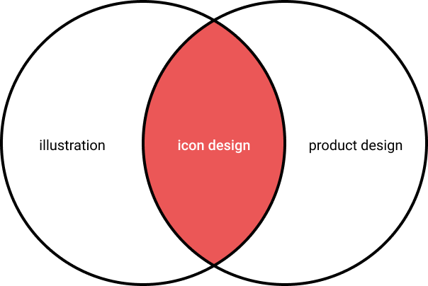
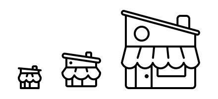
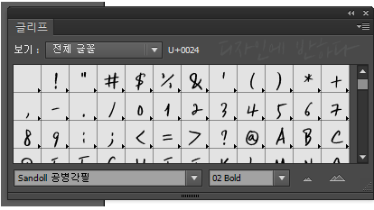
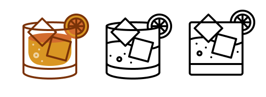
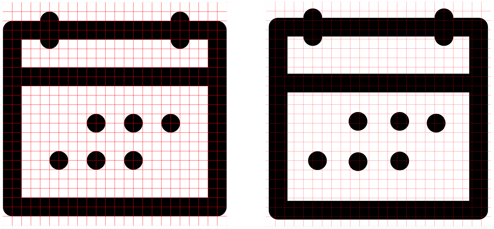
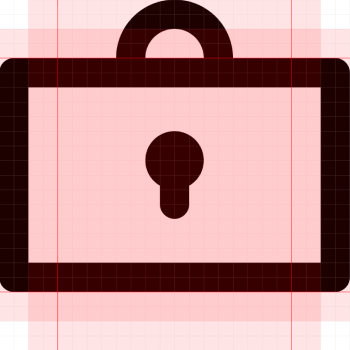

# iconography 이해하기

아이콘은 모든 디자인 시스템이나 제품 경험에서 중요한 부분이다. 아이콘은 사용자가 빠르게 서비스를 탐색하도록 돕고 언어에 구애받지 않는다. 또한 아주 작아서 비용이 그다지 크지도 않다. 아이콘은 좋은 디자인 시스템의 기본적인 부분이며 마케팅 자료에 매우 유용하다. 아이콘은 일러스트레이션된 컨텐츠의 기초적인 구성 요소지만, 또한 매우 기술적이기도 하다. 아이콘을 디자인하는 것을 좋아하는 사람들은 많지 않고, 심지어 그것을 잘 하는 사람들은 더 적다.

디자인 시스템 전문가, 일러스트레이터 또는 프로덕트 디자이너가 되든, 이 가이드는 아이콘을 만드는 방법, 브랜드에 맞게 정렬하는 방법, 디자인 시스템에 구현하는 방법 등을 배울 수 있도록 도와준다. 기본부터 시작해보자.

## 아이콘의 기본 요소

### Size

**아이콘의 핵심은 일관성이다.** 아이콘을 만들 때 모든 아이콘의 크기가 같아야 한다. 그러려면, 서비스의 그리드가 어떻게 정의되는지 알아둘 필요가 있다\(그리드가 8 또는 10의 배수인지?\). 그 다음, 기본 아이콘 크기는 그리드와 직접적으로 관련되어야 한다. 8의 배수 기준의 그리드를 가지고 있다면, 아이콘은 16, 24, 32 크기로 사용될 것이다. 모든 아이콘에 대한 하나의 기준 사이즈를 선택한 후, 엔지니어가 다른 디자이너가 디자인한 다른 크기로 확장할 수 있도록 한다.

글리프 복잡성이 필요할 때, 그 때 크기를 추가하기 시작한다. 예를 들어, 기준 아이콘은 24px 이지만 실제 마케팅에서 아이콘은 80px로 사용될 가능성이 다분하다. 이 때, 두감에 대한 일관성을 유지하면서 더 큰 사이즈에 대한 디테일을 추가하고 싶어질 것이다.

같은 아이콘을 다른 크기로 만들 때, 나는 가장 큰 사이즈로 시작해서 축소해 나가는 것을 좋아한다. 키우면서 요소를 더하는 것보다 디테일을 없애고 단순화하는 것이 훨씬 쉽다. 이러한 방법은 최소화하기 전에 오브젝트에 대한 감각을 준다.


글리프는 윤곽선 글꼴 데이터에서 글자 하나의 모양에 대한 기본 단위를 말한다.



### Color

프로덕트 아이콘의 경우 검은색 1가지 색상을 사용하라. 그 이상이면 컴포넌트들이 너무 복잡해지고 다른 디자이너들이 활용하기에는 어려울 것이다. 마케팅 아이콘의 경우, 브랜드에서 중요한 부분이라면 2가지 색상을 사용하고 싶을 수도 있지만, 나는 개인적으로 아이콘이 하나의 색이어야 한다고 생각한다. 3가지 이상의 색상을 가진 것은 모두 일러스트일 뿐, 아이콘은 아니다.

### Grids

**픽셀 그리드\(pixel grid\)**는 가장 작은 단위인 픽셀을 사용하는 기본 그리드다. 그리드를 사용하면 배치의 일관성을 유지할 수 있도록 도와주며, 전체적인 아이콘의 형태가 좋아질 것이다. Figma를 사용한다면, 'on-pixel'과 off의 차이점을 쉽게 볼 수 있다.

픽셀 그리드를 익혔다면, **옵티컬 그리드\(optical grid\)**를 다룰 차례다. 옵티컬 그리드는 아이콘의 중심이 어디에 있는지, 그리고 그것이 사람의 눈으로 얼마나 큰지 알아내는 데 도움을 준다. 원과 곡선 오브젝트는 사각형보다 시각적 공간을 적게 차지한다. 아이콘을 내보낼 때 모두 동일한 치수가 되도록 고정 크기 컨테이너에 넣는 것이 가장 좋다. 이 내부 패딩을 추가하면 나중에 개발 시 추가적인 번거로움 없이 광학/지각적 가중치를 지원할 수 있다.

시각적으로, 지배적인 오브젝트는 수직과 수평 둘 다 중앙에 위치해야 한다.

### Strokes and fills

일관성이 가장 중요하다고 언급했던 것을 기억하라. filled 아이콘과 stroked 아이콘 두개를 나란히 보는 것은 매우 고통스럽다. 당신의 아이콘들이 모두 같은 방식으로 스타일링되었는지 확인하는 것은 매우 중요하다. 예를 들어, 어떤 것이 선택되어 있음을 보여주기 위해 filled 아이콘 적용 사례를 사용할 수 있지만, 한 스타일로 세트를 만들고 다른 변형을 만들기를 원할 수 있다.

일반적으로 filled 아이콘은 인식성이 더 높다. stroked 아이콘은 작은 디테일을 만드는 데 뛰어나다. 어떤 스타일이 더 적합한지 선택할 때는 전체적인 브랜드도 고려해야 한다.

stroke 아이콘을 만들려면 획이 모두 같은 무게여야 한다. stroked 사이의 여백이 stroke 두께보다 얇지 않도록 권한다.

한 가지 스타일은 충족하지만 다른 스타일은 충족시키지 못하는 아이콘 세트가 있을 수 있다. stroked 아이콘의 filled 버전을 만든다면 라인 작업을 단순화하는 것이 필요하다. 이상적으로 filled 아이콘은 반전된 stroked 아이콘이라기 보다는 그림자 같다. 반대로 filled 아이콘의 stroked 버전을 만드는 것은, 공간에 맞는 stroke 두께와 명확성을 유지하면서 어떤 디테일을 추가할지를 결정해야 한다는 것을 의미한다.

10px보다 작은 크기의 아이콘\(stroke의 두께가 1px-2px 사이\)은 이해도가 떨어지므로 권장하지 않는다.

### Style choices 

아이콘은 브랜드를 반영한다. 아이콘 작업을 할 때 브랜드의 핵심 가치와 시각적 정의를 이해하는 것이 중요하다. 딱딱함/부드러움, 캐주얼/포멀, 고급스러운/경제적인, 직관적/추상적과 같은 형용사로 시각적 특성을 구분하고, 관련 일러스트레이션 스타일도 참조할 수 있다.

아래 예시의 각 열에 해당하는 아이콘 세트는 기본이 되는 아이콘\(X 버튼, 햄버거 메뉴, 체크 아이콘 등\)은 없지만 각 아이콘 스타일이 가지고 있어야할 기본 원칙을 잘 나타낸다. 아이콘의 규칙을 결정할 때 나는 비교적 복잡하고 어려운 아이콘부터 시작하기를 권한다. 어려운 작업이 먼저 되면, 간단한 아이콘들을 디자인하는 것은 쉬울 것이다.

다음은 주요 회사의 비주얼 브랜드와 가치를 반영하는 아이콘 스타일 목록이다.

- [Uber](https://brand.uber.com/guide#iconography-system-icons)
- [Google](https://material.io/tools/icons/?style=baseline)
- [Apple](https://developer.apple.com/design/human-interface-guidelines/ios/icons-and-images/system-icons/)
- [Airbnb](https://www.zachroszczewski.com/airbnb/)
- [Square](https://www.bonniekatewolf.com/icon-system.html/)

## 디자인시스템과 아이콘

다른 팀원이 아이콘에 엑세스할 때, 아이콘 구조화와 어셋 관리, 인지도를 고려하도록 한다.

### 아이콘 구조화

먼저 파일 이름부터 정하자. 아이콘은 어떤 것을 나타내는지가\(represent\) 아니라 어떻게 보여지는지를\(show\) 기준으로 네이밍되어야 한다. 예를 들어, 스톱워치\(stopwatch\) 아이콘은 speed가 아니라 stopwatch라는 이름이 붙어야 한다. 전구\(lightbulb\)는 idea가 아니라 lightbulb라고 불러야 한다. 아이콘은 개념적인 수준에서 전달되는 것이 아니라, 즉시 사람들에게 그 아이콘이 무엇인지 명확히 전달되어야 한다. 짧은 이름이 더 좋다. 여러 단어가 필요할 경우 대시를 사용하여 단어를 구분하라. \(예: chef-hat\)

아이콘에 variant를 추가할 때, 나는 Figma에서 아래와 같이 다룬다.

#### 다양한 크기

한 인스턴스에서 다른 인스턴스로 직접 전환하는 경우는 거의 없으므로 다른 페이지를 사용한다.

#### Filled vs Stroked

둘 다 사용한다면 아이콘 네이밍 뒤에 슬래시를 붙여서 구분한다.

#### 이미지 조정

시각적 variant\(예: 여러 통화 표\)가 있는 아이콘이 있는 경우, filled 아이콘과 stroked 아이콘과 동일한 방법으로 이름을 지정하여 구별할 수 있다.

### 어셋 관리
