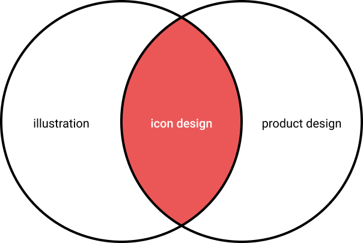
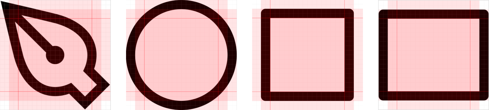

# iconography 이해하기

아이콘은 모든 디자인 시스템이나 제품 경험에서 중요한 부분이다. 아이콘은 사용자가 빠르게 서비스를 탐색하도록 돕고 언어에 구애받지 않는다. 또한 아주 작아서 비용이 그다지 크지도 않다. 아이콘은 좋은 디자인 시스템의 기본적인 부분이며 마케팅 자료에 매우 유용하다. 아이콘은 일러스트레이션된 컨텐츠의 기초적인 구성 요소지만, 또한 매우 기술적이기도 하다. 아이콘을 디자인하는 것을 좋아하는 사람들은 많지 않고, 심지어 그것을 잘 하는 사람들은 더 적다. 

디자인 시스템 전문가, 일러스트레이터 또는 프로덕트 디자이너가 되든, 이 가이드는 아이콘을 만드는 방법, 브랜드에 맞게 정렬하는 방법, 디자인 시스템에 구현하는 방법 등을 배울 수 있도록 도와준다. 기본부터 시작해보자.

## 아이콘의 기본 요소

### Size

**아이콘의 핵심은 일관성이다.** 아이콘을 만들 때 모든 아이콘의 크기가 같아야 한다. 그러려면, 서비스의 그리드가 어떻게 정의되는지 알아둘 필요가 있다\(그리드가 8 또는 10의 배수인지?\). 그 다음, 기본 아이콘 크기는 그리드와 직접적으로 관련되어야 한다. 8의 배수 기준의 그리드를 가지고 있다면, 아이콘은 16, 24, 32 크기로 사용될 것이다. 모든 아이콘에 대한 하나의 기준 사이즈를 선택한 후, 엔지니어가 다른 디자이너가 디자인한 다른 크기로 확장할 수 있도록 한다. 

글리프 복잡성이 필요할 때, 그 때 크기를 추가하기 시작한다. 예를 들어, 기준 아이콘은 24px 이지만 실제 마케팅에서 아이콘은 80px로 사용될 가능성이 다분하다. 이 때, 무게감에 대한 일관성을 유지하면서 더 큰 사이즈에 대한 디테일을 추가하고 싶어질 것이다.

같은 아이콘을 다른 크기로 만들 때, 나는 가장 큰 사이즈로 시작해서 축소해 나가는 것을 좋아한다. 키우면서 요소를 더하는 것보다 디테일을 없애고 단순화하는 것이 훨씬 쉽다. 이러한 방법은 최소화하기 전에 오브젝트에 대한 감각을 준다.


글리프는 윤곽선 글꼴 데이터에서 글자 하나의 모양에 대한 기본 단위를 말한다.



### Color

프로덕트 아이콘의 경우 검은색 1가지 색상을 사용하라. 그 이상이면 컴포넌트들이 너무 복잡해지고 다른 디자이너들이 활용하기에는 어려울 것이다. 마케팅 아이콘의 경우, 브랜드에서 중요한 부분이라면 2가지 색상을 사용하고 싶을 수도 있지만, 나는 개인적으로 아이콘이 하나의 색이어야 한다고 생각한다. 3가지 이상의 색상을 가진 것은 모두 일러스트일 뿐, 아이콘은 아니다.

### Grids

**픽셀 그리드\(pixel grid\)**는 가장 작은 단위인 픽셀을 사용하는 기본 그리드다. 그리드를 사용하면 배치의 일관성을 유지할 수 있도록 도와주며, 전체적인 아이콘의 형태가 좋아질 것이다. Figma를 사용한다면, 'on-pixel'과 off의 차이점을 쉽게 볼 수 있다.

픽셀 그리드를 익혔다면, **옵티컬 그리드\(optical grid\)**를 다룰 차례다. 옵티컬 그리드는 아이콘의 중심이 어디에 있는지, 그리고 그것이 사람의 눈으로 얼마나 큰지 알아내는 데 도움을 준다. 원과 곡선 오브젝트는 사각형보다 시각적 공간을 적게 차지한다. 아이콘을 내보낼 때 모두 동일한 치수가 되도록 고정 크기 컨테이너에 넣는 것이 가장 좋다. 이 내부 패딩을 추가하면 나중에 개발 시 추가적인 번거로움 없이 광학/지각적 가중치를 지원할 수 있다.

시각적으로, 지배적인 오브젝트는 수직과 수평 둘 다 중앙에 위치해야 한다.

### Strokes and fills

일관성이 가장 중요하다고 언급했던 것을 기억하라. fill 아이콘과 stroke 아이콘 두개를 나란히 보는 것은 매우 고통스럽다. 당신의 아이콘들이 모두 같은 방식으로 스타일링되었는지 확인하는 것은 매우 중요하다. 예를 들어, 어떤 것이 선택되어 있음을 보여주기 위해 fill 적용 사례를 사용할 수 있지만, 한 스타일로 세트를 만들고 다른 변형을 만들기를 원할 수 있다.

일반적으로 fill 아이콘은 인식성이 더 높다. stroke 아이콘은 작은 디테일을 만드는 데 뛰어나다. 어떤 스타일이 더 적합한지 선택할 때는 전체적인 브랜드도 고려해야 한다.

stroke 아이콘을 만들려면 획이 모두 같은 무게여야 한다. stroke 사이의 여백이 stroke 무게보다 얇지 않도록 권하기도 한다.

