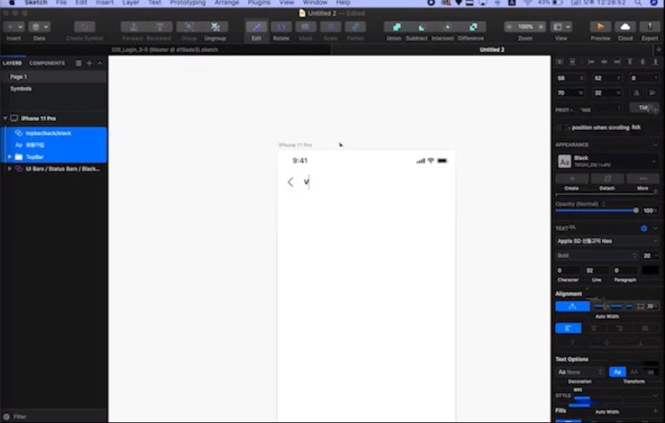
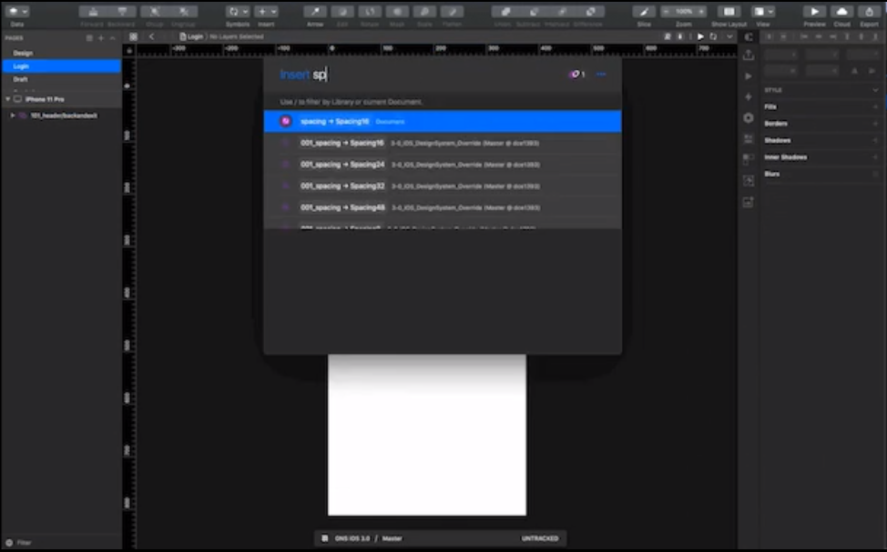
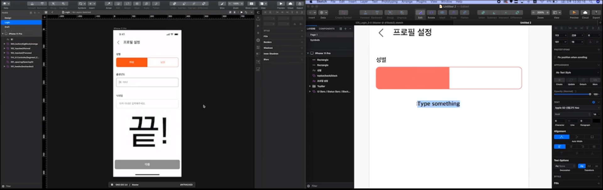
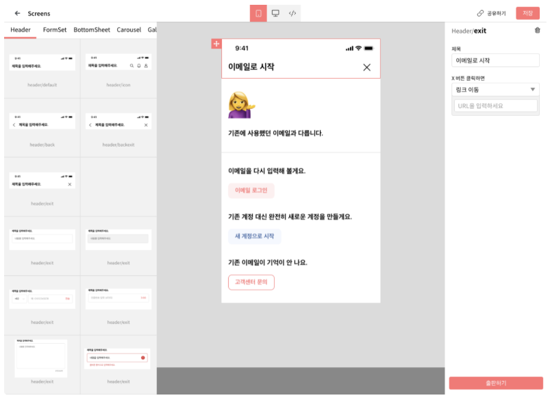

# 강남언니의 디자인 시스템

Cell(앱, 모바일)과 Welchis(백오피스, PC) 두가지 디자인 시스템 설계함.
플랫폼 별 디자인이 많이 다르기 때문에 두개나 만들었음.

# 디자인 시스템 적용으로 생산성 향상

[기존 작업방식과 디자인 시스템 적용으로 빨라진 작업 속도 비교 영상](https://static.blog.gangnamunni.com/files/f0e10ae1-8585-4508-8688-10b9bc1eb738)

위 영상 오른쪽을 보면 기존에는 스케치로 하나하나를 일일이 만들어야 해서 시간이 오래 걸렸다.

디자인 시스템 도입 후에는 이미 만들어진 리액트 컴포넌트를 스케치로 불러와서 디자인 하기 때문에 훨씬 빠르게 디자인을 할 수 있었다.

디자인 시스템을 적용한 작업 방식(왼쪽)에서는 이미 작업이 끝났는데  
이전 방식대로 작업했을때(오른쪽)는 아직도 작업을 반도 못끝냈음.

**엄청난 생산성의 차이가 발생함.**

# Welchis Editor

누구나 쉽게 이미 만들어진 리액트 컴포넌트를 디자인 툴로 불러와 조합해볼 수 있는 에디터를 만들 예정이다.

# [Written by 심재철](https://github.com/simsimjae)

