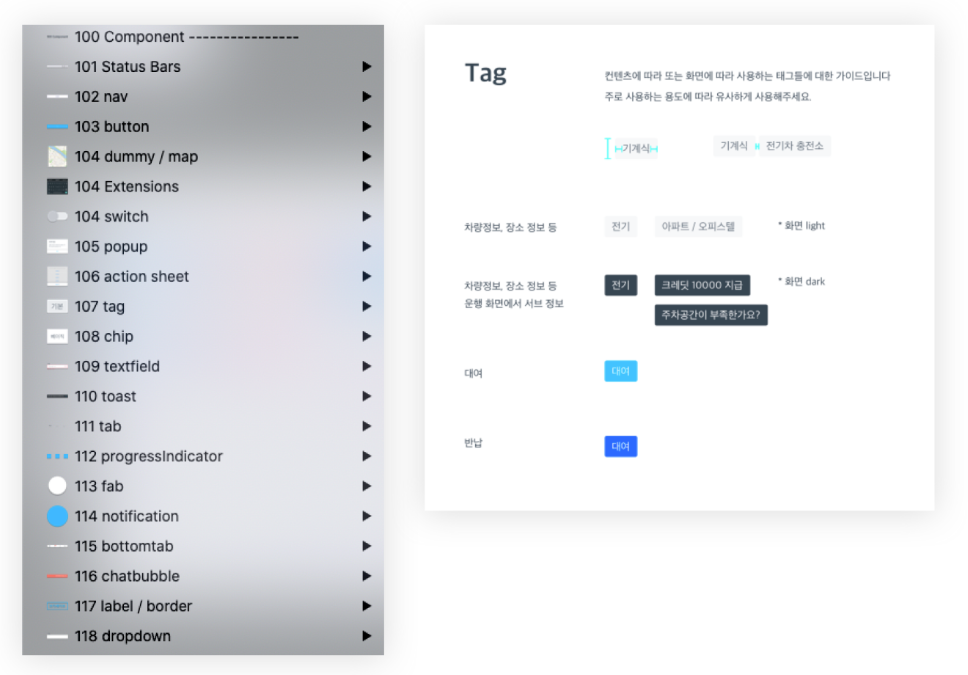
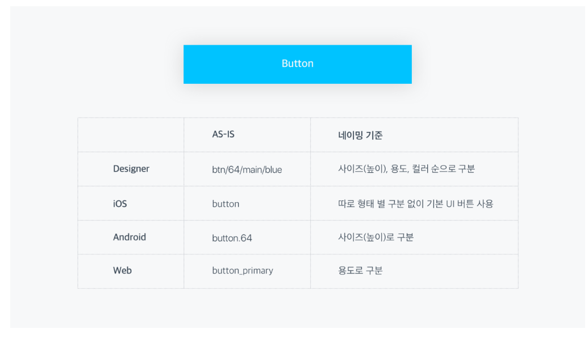
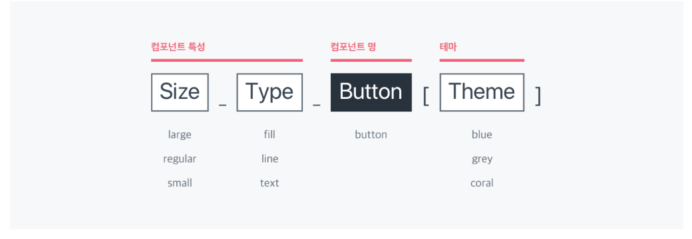
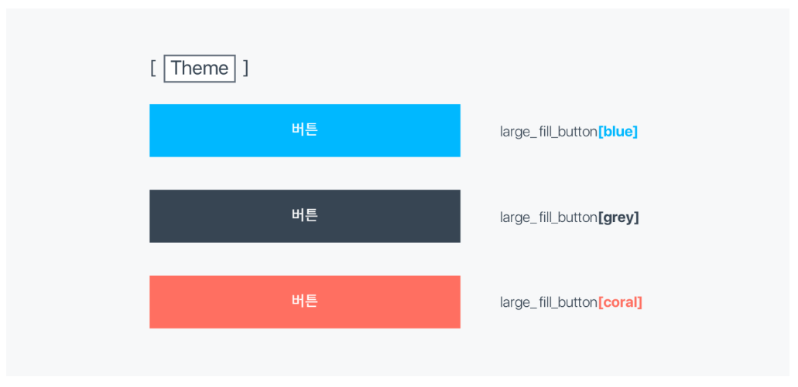
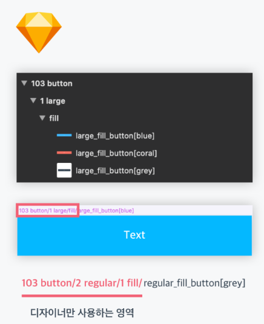
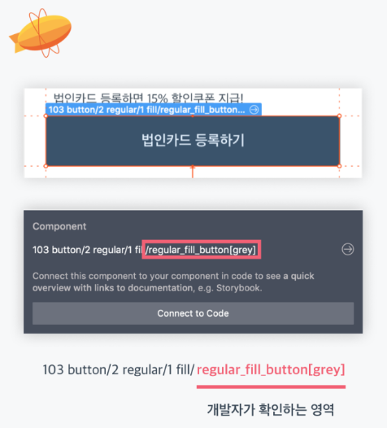
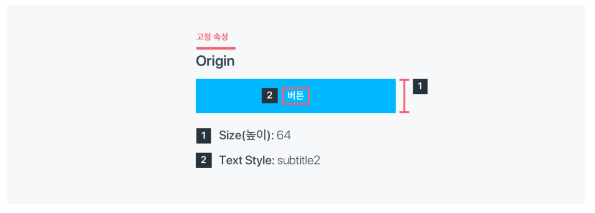

# [쏘카의 디자인 시스템](https://tech.socarcorp.kr/design/2020/07/31/component-01.html)

## [디자인 문서화 도구](https://socarframe.socar.kr/8bb3aba4a/p/8246da-button)

[zeroheight](https://www.zeroheight.com/)라고 하는 도구를 통해서 디자인을 문서화 했음.  
그렇게 해서 만들어진 쏘카의 [프레임 컴포넌트](https://socarframe.socar.kr/8bb3aba4a/p/8246da-button)

# 디자이너와 개발자의 최초 협업 과정

## 디자이너의 기존 작업 방식

- 스케치의 심볼 기능을 활용하여 UI를 연결 및 재활용
- 추가로 스타일 가이드 제공 (디자인 팀 내 UI 일관성을 위해)

## 개발자의 기존 작업 방식

누군가 만들어 둔 컴포넌트를 비슷하게 새로 생성하는 일이 발생했음. (컴포넌트가 재활용 되지 못하고 유사한 컴포넌트가 여러개 존재)

## 네이밍 통일

디자인, 프론트, 앱개발 각 팀에서 컴포넌트를 각기 다른 이름으로 부르고 있었음. 네이밍을 통일해서 커뮤니케이션 비용을 줄이고자 했음.

### 각 팀에서의 컴포넌트 네이밍 차이

각 팀에서 사용하기 편한 이름으로 네이밍을 해야했음.
디자인팀 내부에서는 버튼 하나를 **사이즈, 용도, 컬러등의 속성들로 자세하게 구분**을 하는 반면에 개발팀에서는 **한 두가지 속성만으로 컴포넌트를 구분**하고 있었음.
이런 차이를 통일 시킬 필요성이 생김.

### 정해진 컴포넌트 네이밍 룰

- 사이즈, 타입, 컴포넌트명, 테마 순으로 각 컴포넌트를 네이밍함.
- 약어를 사용하지 않고 풀네임 사용.
- `Snake Case` 사용
- 예를들면, `파란색으로 채워진 큰 버튼`은 `large_fill_button_blue`와 같이 네이밍함

### 테마?

형태가 같은데 색상만 달라야 하는 경우 새로운 타입의 컴포넌트를 추가하는게 아니라 테마를 변경함.

## 협업시 활용 방법

스케치는 심볼을 Grouping할때 자동으로 `/`를 추가하기 때문에 **개발자가 확인해야 하는 부분**과 **디자이너가 확인해야 하는 부분**이 어쩔 수 없이 달라지는 부분이 존재함.

1. 디자이너가 `regular_fill_button[blue]` 심볼을 제플린으로 내보내면
   

2. 개발자는 제플린에서 가장 마지막 `/`이후를 확인해서 컴포넌트를 수정함
   

개발자와 디자이너가 확인해야하는 영역이 다른 이유는 **스케치에서 심볼 그룹핑을 /로 하기 때문**

### 고정속성과 가변속성

컴포넌트를 설계할때 **변경이 가능한 값(Option)**과 **변경이 불가능한 값(Origin)**을 구분함.

변경이 불가능한 값은 컴포넌트의 고유한 속성이므로 달라질 수 없으며 **이 변경 불가능한 값이 조금이라도 달라져야 한다면 그것은 새로운 컴포넌트가 만들어져야 한다는 뜻임.**

예를들어, 위와 같이 버튼의 `높이`와 `텍스트의 스타일`은 **고정속성(Origin)**임  
반면, 버튼의 `베이스컬러(파란색)`과 `텍스트컬러(흰색)`은 **변경 가능한 옵션 값(Option)**임

디자이너는 스케치의 Symbol Overrides를 통해 Option값을 수정하고,  
개발자는 리액트의 Props를 통해 Option값을 수정함.

# [Written by 심재철](https://github.com/simsimjae)

