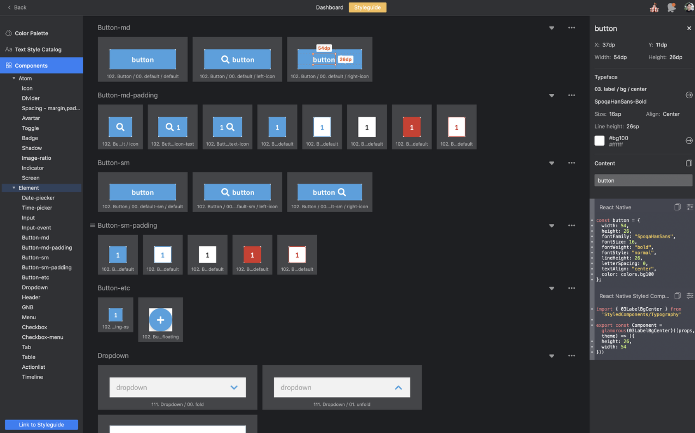

# [케어닥의 디자인 시스템](https://brunch.co.kr/@fifthsage/4)

## 요약

- 아토믹 디자인 사용
- 디자인에서도 아토믹 디자인 5단계 구조(atoms, molecules, organisms, ...)에 맞춤.
- 디자이너들이 디자인한 컴포넌트들을 제플린에 업로드해주면 개발자들은 제플린의 스타일 가이드를 참고해서 실제 컴포넌트에 그대로 반영

위 스타일 가이드를 참고하여 개발자들은 실제로 컴포넌트를 작성한다.

# [우아한 형제들의 디자인 시스템](https://velog.io/@velopert/%EC%9B%90%ED%8B%B0%EB%93%9C-%EC%9A%94%EC%A6%98-%ED%94%84%EB%A1%A0%ED%8A%B8%EC%97%94%EB%93%9C-%EA%B0%9C%EB%B0%9C-%EC%96%B4%EB%96%BB%EA%B2%8C-%ED%95%98%EC%A7%80-%EC%B0%B8%EA%B4%80-%ED%9B%84%EA%B8%B0#%EC%9A%B0%EC%95%84%ED%95%9C%ED%98%95%EC%A0%9C%EB%93%A4---%EB%94%94%EC%9E%90%EC%9D%B8-%EC%8B%9C%EC%8A%A4%ED%85%9C%EC%9C%BC%EB%A1%9C-%EA%B0%80%EB%8A%94-%EA%B8%B8)

## 배달의 민족에서 디자인 시스템을 적용하기로 한 이유

### 1. 묘하게 다른 디자인

A페이지에 사용되는 컴포넌트와 B페이지에서 사용되는 컴포넌트를 작업한 **디자이너가 달라서** 유사하지만 미세하게 다른 디자인이 계속해서 생산되고 있었다.

### 2. QA과정을 없애기 위해

기획 - 디자인 - 개발 프로세스를 가질때, **디자인이 변경되거나** 혹은 **디자인과 마크업이 틀어지는 경우** 에는 그에 맞춰 개발도 수정을 해야 하는 경우가 생긴다.

만약 디자인 시스템이 잘 정립된다면 이런 **디자인QA**에서의 시간낭비를 크게 줄일 수 있을거라 생각했다.

### 3. 페이지별 PV 차이

Page View가 높은 페이지들에 사용되는 컴포넌트들은 많은 관심을 받기 때문에 최신화 되어 있고 트렌디하다. 하지만 그렇지 않은 페이지들은 예전에 만들어둔것들이 업데이트 되지 않고 계속해서 서비스 되고 있다. (예를들면, 마이페이지) 이 차이를 극복하여 유저가 일관된 디자인경험을 할 수 있도록 만들기 위해 디자인 시스템을 만들고자 했다.

결과적으로 배민에서는 서비스내의 **디자인의 일관성**과 **작업 프로세스의 효율성** 이 두가지를 위해서 디자인 시스템을 도입했다고 할 수 있다.

## 디자인 시스템 적용의 어려움

### 1. 디자이너들을 설득해야함.

이 시스템이 왜 필요한지 디자이너들을 설득하는데도 사내 교육을 통해 많은 시간을 써야 했다.

### 2.

# [ Written by 심재철](https://github.com/simsimjae)

