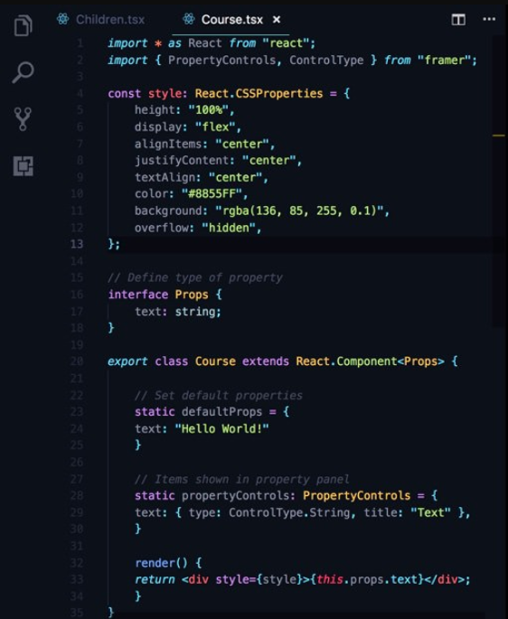
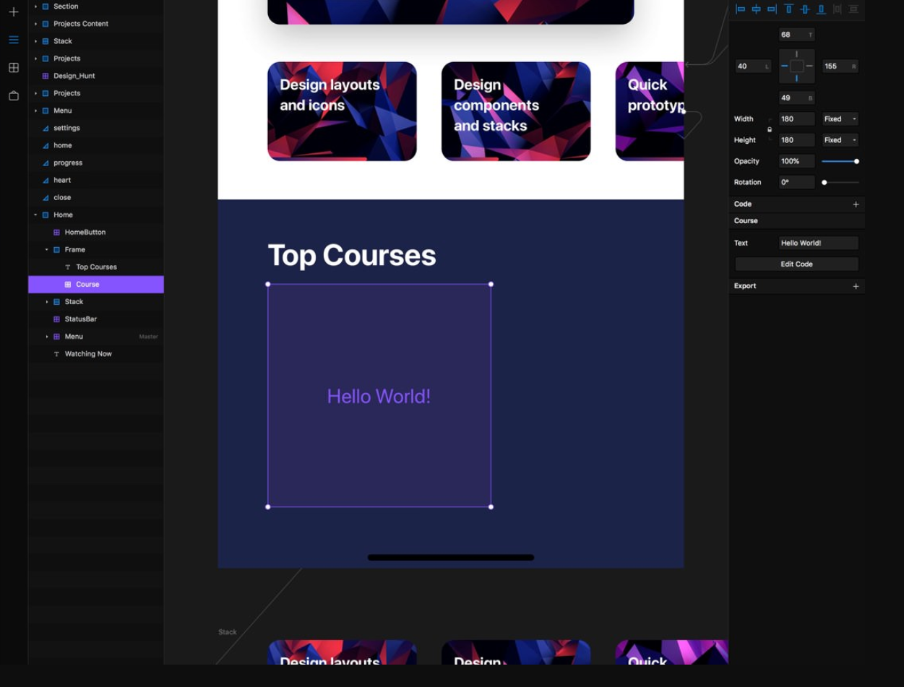
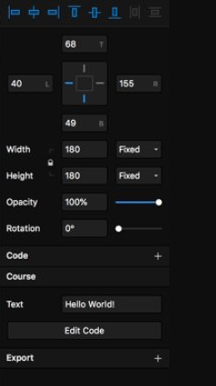

# 디자인 시스템을 구축하기 위한 디자인 툴 선택 가이드

결론부터 얘기하자면, 디자인 시스템을 구축하기 위해 현재 가장 좋은 툴이라고 생각하는것은 `Framer X`이다.

# 리액트 컴포넌트 To 디자인
`스케치`나 `피그마`도 리액트 컴포넌트를 **플러그인을 통해서** 디자인 툴로 불러올 수 있긴 하다.
하지만 어떤 문제가 있는지 살펴보자.

## 플러그인 API에 컴포넌트가 종속되는 문제

### React Sketch.app
스케치에서는 리액트 컴포넌트를 Import할때 airbnb에서 만든 [React Sketch.app](https://github.com/airbnb/react-sketchapp)을 사용한다.
이 플러그인은 실제로 에어비엔비에서 사용되고 있으며 아직까지 큰 문제는 없어보인다.

대략 아래와 같이 사용하면 된다.
```js
import * as React from 'react';
import { render, Text, Artboard } from 'react-sketchapp';

const App = props => (
  <Artboard>
    <Text style={{ fontFamily: 'Comic Sans MS', color: 'hotPink' }}>{props.message}</Text>
  </Artboard>
);

export default context => {
  render(<App message="Hello world!" />, context.document.currentPage());
};
```
여기서 가장 큰 문제가 하나 있는데 바로 `react-sketchapp` 모듈에서 제공하는 컴포넌트만 사용할 수 있다는 점이다.
그 외의 컴포넌트를 사용하게 되면 스케치에서 정상적으로 렌더링 되지 않을 것이다.

언뜻 보면 그게 무슨 문제냐고도 할 수 있겠지만, **디자인 툴에 코드가 종속된다는것은 잠재적인 어려움들을 포함하고 있다는 뜻이다.**
코드가 스케치에 종속되어 있기 때문에 디자인 툴을 쉽게 변경하지 못하며, 어쩔수 없이 디자인 툴을 변경하게 되었을때 이미 `react-sketchapp`으로 작성된 수많은 컴포넌트들을 리팩토링 해야 한다는 말이다.
만약 그떄 당시 컴포넌트가 몇천개라면?? 차라리 새로 만드는게 나을수도 있다.

### [react-figma](https://github.com/react-figma/react-figma)
이 플러그인은 피그마에서 react component를 불러올 수 있는 플러그인이다.

실제로 example에 나와있는대로 작성해보면 잘 렌더링이 되지만 이것도 마찬가지로 위에서 설명한 문제를 그대로 갖게 된다.

```js
import * as React from 'react';
import { Page, View, Text } from 'react-figma';

export const App = () => {
    return (
        <Page name="New page" isCurrent>
            <View>
                <View style={{ width: 200, height: 100, backgroundColor: '#dd55aa' }} />
                <Text style={{ color: '#ffffff' }}>text</Text>
            </View>
        </Page>
    );
};
```
`react-figma` 패키지에서 제공하는 컴포넌트만을 사용해서 컴포넌트를 작성해야한다.
실제로 해당 플러그인이 버그 없이 얼마나 잘 작동하든 디자인 툴에 코드가 종속되는 문제는 피할 수 없는것이다.

### Framer X?
이 문제는 거의 유일하게 Framer X를 통해서만 해결 될 수 있다.
Framer는 라이브러리에서 제공하는 컴포넌트를 사용하지 않아도 컴포넌트를 그대로 디자인툴에서 렌더링 할 수 있다.

이 부분이 **Framer X이 다른 디자인 툴과는 차별화되는 큰 강점이라고 할 수 있다.**

Framer X에서는 리액트 컴포넌트 코드가 툴에 종속되지 않는다.

  

이런식으로 vscode에서 작성중인 리액트 컴포넌트를

  

Framer X로 가져와서 그대로 렌더링할 수 있다.

유일하게 Framer X의 API를 사용한것은 `PropertyControls`뿐이다.



프레이머의 컨트롤 패널에서 `Course > Text` 부분에 값을 수정할 수 있게 만들기 위해서 `PropertyControls`를 추가한 것일 뿐이다.

이렇듯 디자인툴과 코드를 유연하게 연결할 수 있는것이 프레이머의 가장 큰 장점이다.

## [Written by 심재철](https://github.com/simsimjae)


