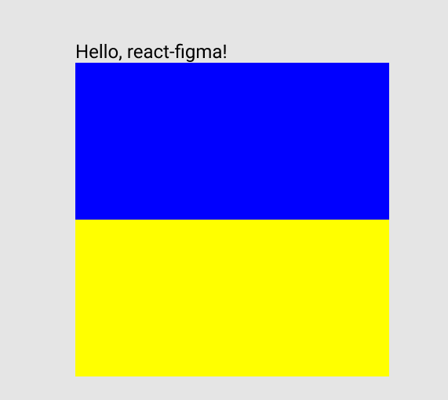

# react-figma에 react-primitives 적용하기

react-figma에서 제공하는 컴포넌트를 사용하게 되면 리액트 코드가 피그마에 종속되는 문제가 발생한다.

따라서, 플랫폼에 종속적이지 않은 라이브러리의 컴포넌트를 사용하는것이 좋은데 그 문제를 해결해주는게 바로 `react-primitives`이다.

# [react-primitives란?](https://github.com/lelandrichardson/react-primitives)

[공식문서](https://github.com/lelandrichardson/react-primitives)에는 이 라이브러리를 이렇게 소개하고 있다.

이 라이브러리는 플랫폼에 상관없이 리액트 애플리케이션을 빌드할수 있는 원시적인 요소의 집합입니다.
미래에는 이 라이브러리가 `react`와 `react-native`의 공통 컴포넌트로 사용 될 것입니다.

스타일을 사용하기 위해서 `StyleSheet`를 사용하며 애니메이션을 위해 `Animated`를 사용합니다.

다음과 같은 API들이 존재합니다.

- Animated: [animated](https://github.com/animatedjs/animated) 프로젝트에서 가져옴.
- StyleSheet: React Native 스타일의 API를 똑같이 따라 만들었음.
- View: 레이아웃의 기본이 되는 컴포넌트
- Text: 텍스트 컴포넌트
- Image: 이미지 컴포넌트
- Touchable: 인터렉션 컴포넌트
- Easing: `easing functions`의 모음집
- Dimensions: 디바이스 dimensions를 가져옴
- PixelRatio: 디바이스의 픽셀 density를 가져옴
- Platform: iOS, Android, Web, Sketch ... 와 같은 플랫폼 중 현재 어떤 플랫폼에서 이 라이브러리가 실행되고 있는지를 가져옴.

미래에는 `TextInput`가 추가될 예정입니다.

## react-primitives 사용법

```js
import React from "react";
import { View, Text, Image, StyleSheet } from "react-primitives";

class Foo extends React.Component {
	render() {
		return <View style={styles.foo}>{this.props.children}</View>;
	}
}

// 스타일 적용하는 방법(객체 스타일)
const styles = StyleSheet.create({
	foo: {
		width: 100,
		height: 100,
		backgroundColor: "#ff00ff"
	}
});
```

# react-figma에 있는 컴포넌트를 react-primitives로 교체해보자.

**src/App.tsx**

```js
import * as React from "react";
import { Page } from "react-figma";
import { View, Text } from "react-primitives";

export const App = () => {
	return (
		<Page isCurrent name="Page X">
			<Text characters="Hello, react-figma!" />
			<View style={{ width: 200, height: 100, backgroundColor: "blue" }} /> // 색상을 blue로 변경
			<View style={{ width: 200, height: 100, backgroundColor: "yellow" }} />
		</Page>
	);
};
```

react-figma에서 제공하는 Page컴포넌트는 어쩔수없이 사용해야 하지만 최상단에 하나만 선언해주면 되기 때문에 큰 문제가 되지는 않을 것 같다.
react-figma에서 제공하는 `Rectangle 컴포넌트`를 react-primitives에서 제공하는 `View 컴포넌트`로 변경하였다.

이렇게 했을때 잘 렌더링 되는지 확인해보자.



잘 된다.

## [Written by 심재철](https://github.com/simsimjae)


