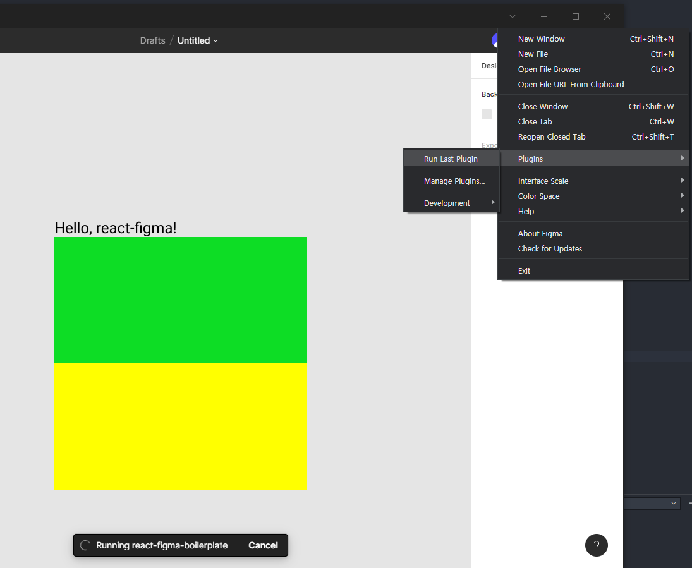

# 리액트 컴포넌트를 피그마에서 렌더링하기 (react-figma)

## 1. [react-figma boilerplate clone](git clone https://github.com/react-figma/react-figma-boilerplate.git react-figma)

## 2. [피그마 데스크탑 앱 설치](https://www.figma.com/downloads/)

## 3. boilerplate 설치 및 실행

방금 설치한 boilerplate 프로젝트를 VSCODE로 켠 다음

```bash
npm install
```

```bash
npm webpack:watch
```

차례로 입력해주면 dist폴더가 만들어진다.

## 4. 피그마에 플러그인 연결


피그마 좌측 메뉴에서 Draft를 누른다.


우측 메뉴에서 Plugins > Manage Plugins 클릭


In Development에서 Create your own plugin 옆 `+` 클릭

(우리는 이미 만들어진 boilerplate를 피그마에 연결할것이므로 새로 생성하는게 아니라 기존에 있는걸 연결하는것임)


아래 choose a manifest.json 클릭


manifest.json 파일 선택후 완료


이제 react-figma 플러그인이 정상적으로 피그마로 연결되었다.

이제 코드를 변경했을때 피그마에서 제대로 렌더링 되는지 알아보자.


Draft로 다시 가서 우측 메뉴를 누른다음 방금 추가한 플러그인을 선택한다.


이런 화면이 떴다면 성공

다시 vscode로 돌아가서 코드를 수정해보자.

src/App.tsx의 코드에서 아래 Rectangle의 색을 yellow로 바꿔보자.

```js
import * as React from "react";
import { Page, Rectangle, Text } from "react-figma";

export const App = () => {
	return (
		<Page isCurrent name="Page X">
			<Text characters="Hello, react-figma!" />
			<Rectangle style={{ width: 200, height: 100, backgroundColor: "#0ddd25" }} />
			<Rectangle style={{ width: 200, height: 100, backgroundColor: "yellow" }} /> // yellow로 변경됨.
		</Page>
	);
};
```

다시 피그마로 돌아가서


Run Last Plugin을 누르거나 Ctrl + Alt + P(윈도우), ⌥⌘P(맥)을 통해서 플러그인을 재실행시켜보자.


정상적으로 변경되었으면 성공

## [Written by 심재철](https://github.com/simsimjae)


