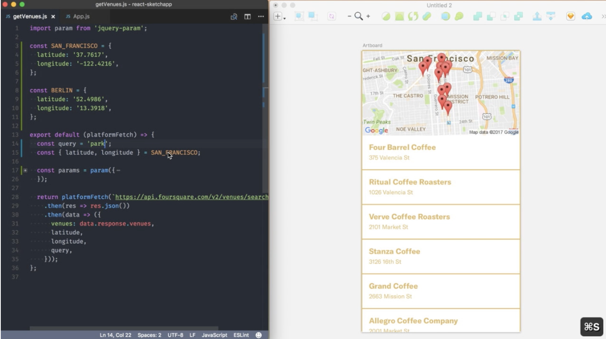
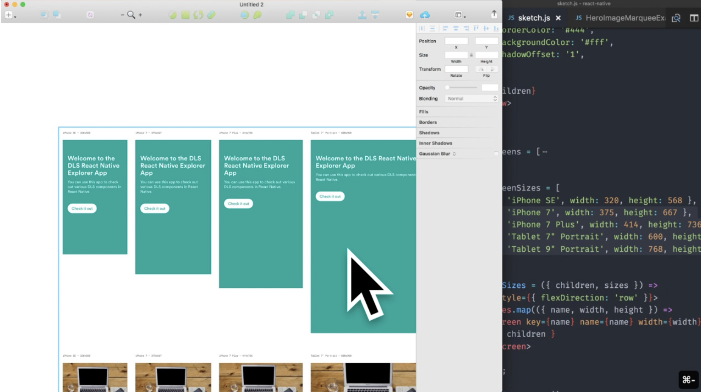
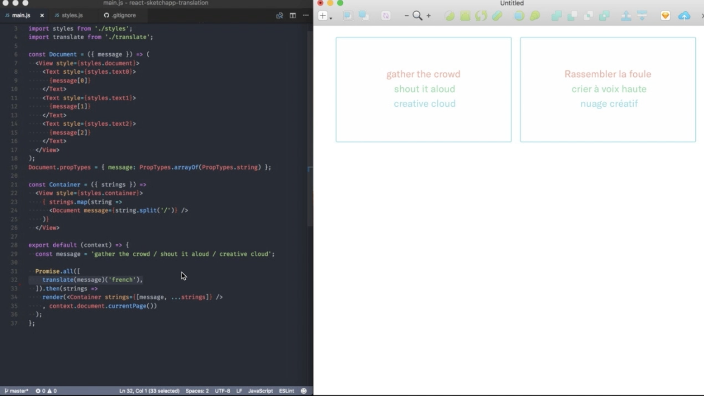
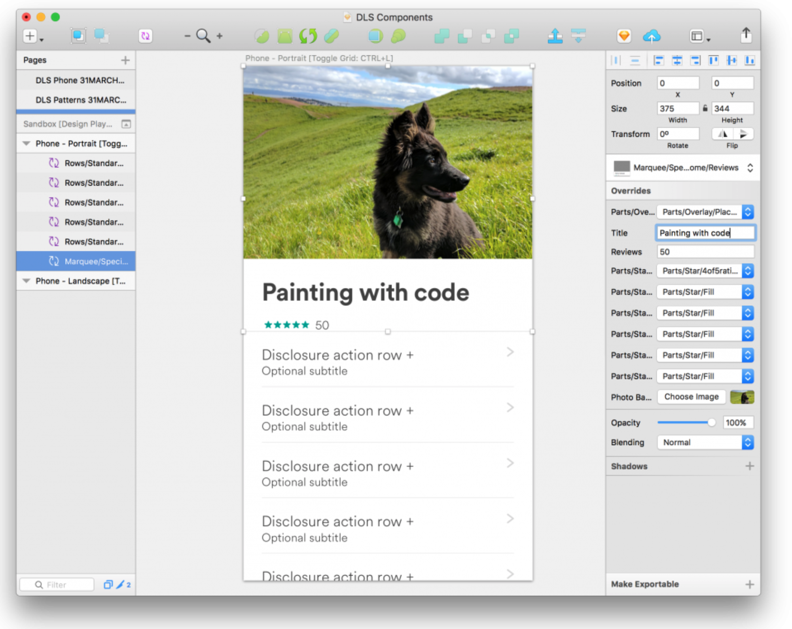
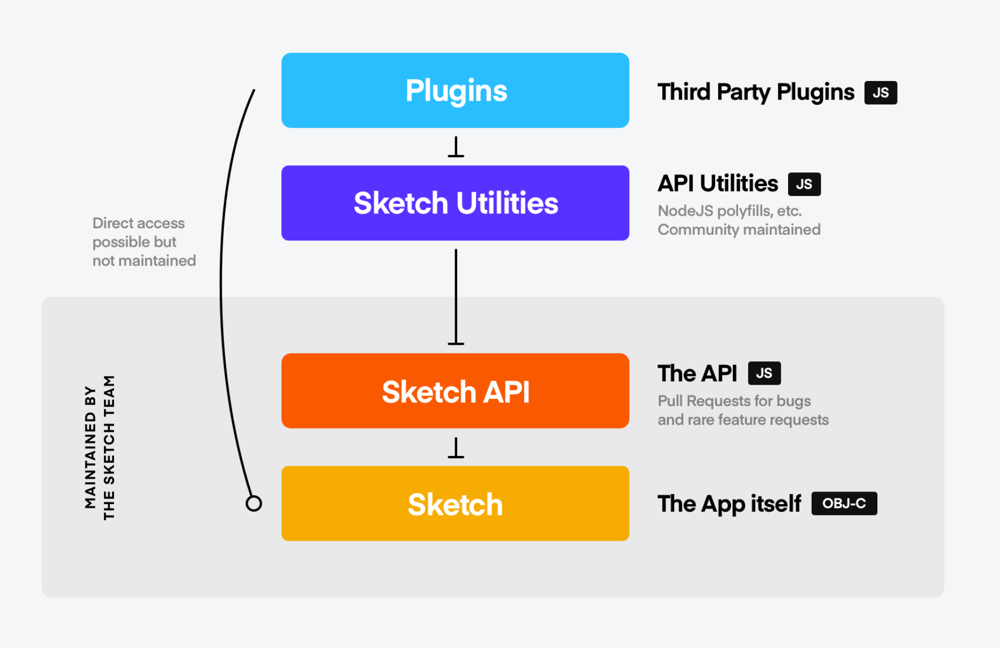

# React Sketch.app

## 스케치와 리액트를 연결해주는 도구 [React Sketch.app](https://airbnb.design/painting-with-code/) \(by airbnb\)

## 소개

**코드와 함께 디자인하기**

이 툴은 큰 규모의 디자인 시스템에서 디자이너와 개발자간의 갭을 줄이기 위해서 만들어졌다. [리액트 스케치앱](https://github.com/airbnb/react-sketchapp)은 리액트 컴포넌트를 스케치에 렌더링 하기 위해 만든 오픈소스 리액트 라이브러리다.

### 이 플러그인으로 할 수 있는 것들

#### 매끄러운 실시간 데이터 통합

오른쪽 화면은 react-sketchapp을 실행한 화면인데 실제로 구글맵 API를 사용한 코드를 스케치에 렌더링한것이다. 컴포넌트의 Props를 변경해가면서 스케치앱에 어떻게 렌더링되는지를 확인해가면서 디자인 할 수 있다.

#### flexbox 레이아웃

React Sketch.app은 flexbox를 사용하여 레이아웃을 잡는다. 여기서 제공하는 컴포넌트들을 사용해서 다양한 레이아웃을 잡을 수 있다. 또한 디바이스 사이즈에 맞게 각 컴포넌트를 렌더링해 볼 수도 있다.

#### 자동 국제화

구글 번역 API를 사용해서 실시간으로 컴포넌트 내부에 들어가는 텍스트를 번역해볼 수 있다. 그랬을때 디자인이 어색하지 않은지 디자인 단계에서 확인이 미리 가능하다는 말이다. 수동으로 일어, 중국어, 영어등을 넣어서 테스트 할 필요가 없다는 것이다.

### 스케치에 리액트를 통합하려고 한 이유

### Sources of Truth

**진실의 원천**이라는 뜻인데, 한마디로 한곳에서 최신본의 소스를 관리해야한다는 말이다.

airbnb에서는 조직이 커짐에 따라 디자인 시스템 관리에 큰 어려움을 겪었다고 한다. 디자인 시스템에 어떤 사소한 변화가 추가되면 그에 따른 수많은 추가 작업들이 동반되었다.

예를들어, 시스템에 네모난 버튼을 동그란 버튼으로 수정했는데 이걸 반영하기 위해

1. 문서를 업데이트 해야 했고,
2. 각 개발에 반영\(ios, android, web\)해야 했고,
3. 스케치의 템플릿에 반영해야 했다. **\(병목 현상 발생\)**

이런 일이 생긴 원인은 소스가 한곳에 집중되어 있지 않고 여러 사본이 존재하기 때문에 발생하는 일이었다. 서로 다른 소스의 싱크를 맞춰야 했다.

디자인 시스템의 변경사항을 코드에 반영하는것은 생각보다 어렵지 않았는데, **스케치 템플릿에 반영하는것은 꽤 번거로웠다.** 스케치의 템플릿은 서로 연결되지 않고 사람이 수동으로 관리해야하는 포인트가 많았기 때문이다. **우리는 스케치 템플릿에서 병목현상을 겪었다.**

디자인 시스템 내에서의 변화는 추적이 되어야 한다. \(예를들어, 컬러 하나를 변경하면 이 컬러를 사용하는 많은 컴포넌트에서의 변화를 일으킨다.\) 만약 line-height나 spacing이 변경되면 이걸 사용하는 수많은 컴포넌트는 다시 디자인되어야 했다. 하나하나의 디자인 변경사항이 잠재적인 에러나 불일치를 야기할 수 있었다. 스케치와 같은 그래픽 기반 툴은 버전 관리가 힘들기로 악명이 높다. 우리는 이런 병목현상을 제거해야만 했다.

### 실존하는것을 사용하자

스케치에서 디자이너의 워크플로우는 컴포넌트를 가져와서 그 내부를 채운다는 관점에서 리액트 컴포넌트를 작성하는 워크플로우와 상당히 유사하다.

1. 스케치에서는 **symbol**과 **override**를 사용한다.
2. 리액트에서는 **components**와 **props**를 사용한다.

두가지의 컨셉이 매우 유사해서 그 둘을 통합하기 쉬웠다. 우리는 **진실의 원천을 최소화** 하기를 원했다. 이미 만들어져 수많은 사람들에게 사용되고 있는 컴포넌트를 굳이 스케치에서 수동으로 관리하는 이유가 뭘까?

**더 적은 수의 진실의 원천\(sources of truth\)를 가질 수록, 더 효율적이다.**


“Many hard problems are best solved when they are addressed backward.”  
— Charlie Munger, Vice-Chairman of Berkshire Hathaway

\(많은 어려운 문제들은 역방향으로 다뤄질때 가장 잘 해결된다.\)  
이미 만들어진 컴포넌트를 디자인에 가져와서 수정하는것이 효율적임을 설명하기 위해 인용한 것 같다.


디자인 툴에서 코드를 뽑아내려는 시도는 오래전부터 진행되어왔다. 하지만 우리는 관점을 반대로 바꿔 코드에서 스케치파일을 뽑아내기 위해 노력했다.

2016년까지 스케치를 다루기 위해서는 CocoaScript라고 하는 가장 개발자에게 인기 없는 언어를 사용했었다. 우리는 최신 자바스크립트를 통해 스케치를 다루고 싶었다.

2020년 현재 스케치에서는 javascript API를 베타버전으로 공개를 한 것 같다. \([링크](https://developer.sketch.com/reference/api/)\)

스케치팀에서는 **OBJ-C**와 **JS**를 통해 Sketch API를 관리하고 개발자들은 플러그인이나 유틸리티를 JS로 작성할 수 있다.

## 요약

1. 큰 규모의 기업에서 사용하는 시스템에서 중요한것은, **Sources of Truth**를 최소화 하는것이다.
2. 그 방법 중 하나로 리액트 코드를 스케치에서 렌더링해서 사용하는 방법을 생각 해 냈다.
3. 그래서 **React Sketch.app**을 만들었다.

## [Written by 심재철](https://github.com/simsimjae)

